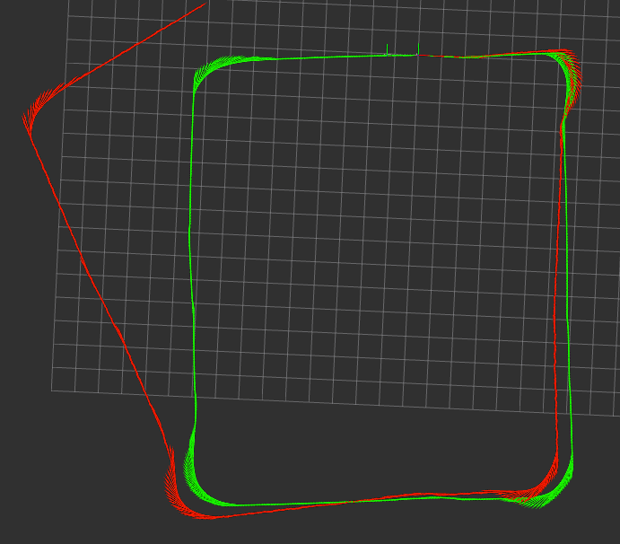

# Sensor Fusion

In this repo, I am going to share how to do sensor_fusion using the [robot_localization](https://github.com/cra-ros-pkg/robot_localization)(RL) package. Bagfiles have been provided in this repository. You can use it to do you own testing for your robot_localization setup. Besides, you can write your own sensor fusion filter and use the bagfile to do testing and verification also.

> Don't talk so much, show me the result first!!! red is the raw odometry data while the green is filtered odometry with imu data

<p align="center">
  
</p>

## Table Of Contents

1. Introduction
2. How to run
   - Odometry + IMU
   - Odometry + IMU + GPS

## How to run

1. Odometry + IMU

```
roslaunch sensor_fusion imu_odom_RL.launch
```

## Useful Commands

1. Use `rosbag filter` create a new bag file with multiple topics within it

```
rosbag filter <original-bagfile> <filtered-bagfile> "topic == '/imu/data' or topic == '/tf_static' or topic == '/husky_velocity_controller/odom'"
```

## Reference

1. [robot_localization](https://docs.ros.org/en/noetic/api/robot_localization/html/index.html#)
2. [ros-sensor-fusion-tutorial](https://github.com/methylDragon/ros-sensor-fusion-tutorial)
3. [Fusing Wheel Odometry and IMU Data Using robot_localization in ROS](https://blog.abdurrosyid.com/2021/07/21/fusing-wheel-odometry-and-imu-data-using-robot_localization-in-ros/)
